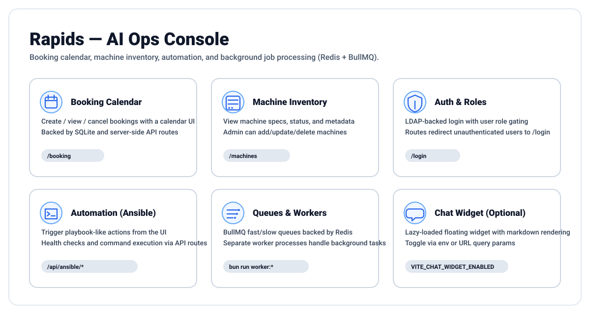

# Rapids — AI Ops Console

A full-stack app for managing a shared machine fleet: calendar booking, machine inventory, automation endpoints, and Redis-backed background work.



## Highlights

- Booking UI: reserve machines in `/booking` (SQLite persistence)
- Fleet inventory: view/edit machines in `/machines` (admin-gated mutations)
- Auth: LDAP login flow via `/login` and `/api/auth/*`
- Background work: BullMQ fast/slow queues backed by Redis (+ workers)
- Optional chat widget: lazy-loaded, markdown capable, toggleable

## Quickstart

Prereqs:
- `bun` (see `package.json#packageManager`)
- Docker (for Redis)

Run (recommended):

```bash
./run.sh
```

Or run manually:

```bash
bun install
docker run -d --name redis -p 6379:6379 --restart unless-stopped redis:alpine
bun run dev
```

Open:
- `http://localhost:3000/booking`
- `http://localhost:3000/machines`

Common commands:

```bash
bun run build
bun run test
bun run typecheck
```

## Background Workers

```bash
bun run worker:fast
bun run worker:slow
bun run worker:perm
```

## Data & Utilities

- SQLite DB lives at `data/booking.db` (auto-initialized on boot)
- Seed machines: `bun run seed:machines`
- Generate Ansible hosts: `bun run generate:ansible`
- Run both: `bun run setup:all`

## Chat Widget Toggle

The floating chat widget is lazy-loaded and can be disabled:

- Build-time: set `VITE_CHAT_WIDGET_ENABLED=false`
- Runtime (URL): add `?chatWidget=0` (also supports `?chat=0`, `?chat_widget=0`)

Note: app default is enabled when `VITE_CHAT_WIDGET_ENABLED` is not set; `run.sh` defaults it to `false`.

## Routes (overview)

Pages:
- `/booking` booking calendar + user bookings
- `/machines` fleet inventory + admin tools
- `/login` LDAP login
- `/help` framework feature landing page
- `/demo/*` framework demos

API:
- `/api/bookings/*` create/list/delete bookings
- `/api/machines/*` list/update/delete machines
- `/api/calendar/*` calendar-facing endpoints
- `/api/ansible/*` automation endpoints
- `/api/queues/*` queue status/control APIs
